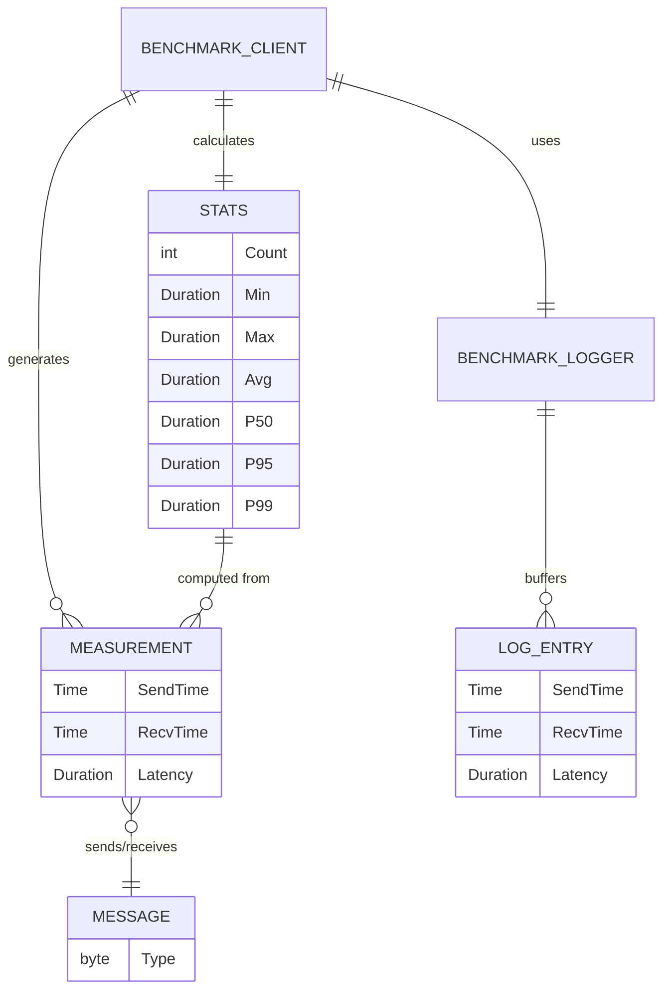

# Domain Entities — Minimum Latency System

## Entidades de Dominio

---

### Message

Representa un mensaje del protocolo binario.

```go
// Message types
const (
    TypeStimulus byte = 0x01  // Client → Server
    TypeResponse byte = 0x02  // Server → Client
)
```

**Propiedades**:
- `Type` (byte): Tipo del mensaje (0x01 o 0x02)
- No tiene payload (protocolo ultra-minimal, 1 byte total)

**Invariantes**:
- El tipo siempre es 1 byte
- Solo existen 2 tipos válidos: Stimulus y Response
- Tamaño total del mensaje en wire: exactamente 1 byte

---

### Measurement

Representa una medición individual de latencia del benchmark.

```go
type Measurement struct {
    SendTime time.Time     // Timestamp de envío del estímulo
    RecvTime time.Time     // Timestamp de recepción de la respuesta
    Latency  time.Duration // recvTime - sendTime
}
```

**Propiedades**:
- `SendTime`: Siempre < `RecvTime` (asumiendo reloj monotónico)
- `Latency`: Siempre >= 0
- `Latency` == `RecvTime` - `SendTime`

**Uso**: Almacenada en el buffer pre-allocated del BenchmarkLogger

---

### Stats

Representa las estadísticas calculadas a partir de todas las mediciones exitosas.

```go
type Stats struct {
    Count  int            // Número de mediciones exitosas
    Min    time.Duration  // Latencia mínima
    Max    time.Duration  // Latencia máxima
    Avg    time.Duration  // Latencia promedio
    Median time.Duration  // Mediana (p50)
    P50    time.Duration  // Percentil 50 (== Median)
    P95    time.Duration  // Percentil 95
    P99    time.Duration  // Percentil 99
    Total  time.Duration  // Suma total de todas las latencias
}
```

**Invariantes**:
- `Min` ≤ `Median` ≤ `Max`
- `P50` ≤ `P95` ≤ `P99`
- `Count` == número de iteraciones exitosas (puede ser < 10,000 si hubo errores)
- `Avg` == `Total` / `Count`
- `P50` == `Median`

---

### BenchmarkConfig

Configuración del benchmark (parseada desde flags).

```go
type BenchmarkConfig struct {
    Host       string // Default: "127.0.0.1"
    Port       int    // Default: 8080
    Iterations int    // Default: 10000
    LogFile    string // Default: "benchmark.log"
}
```

---

### ServerConfig

Configuración del servidor (parseada desde flags).

```go
type ServerConfig struct {
    Port int // Default: 8080
}
```

---

### LogEntry

Entrada individual del log de trazabilidad (buffer interno del BenchmarkLogger).

```go
type LogEntry struct {
    SendTime time.Time
    RecvTime time.Time
    Latency  time.Duration
}
```

**Nota**: No se usa un struct en runtime — el BenchmarkLogger usa 3 slices paralelos pre-allocated para evitar overhead de struct allocation:

```go
type BenchmarkLogger struct {
    sendTimes []time.Time     // Pre-allocated [iterations]
    recvTimes []time.Time     // Pre-allocated [iterations]
    latencies []time.Duration // Pre-allocated [iterations]
    count     int             // Current index
}
```

**Justificación**: 3 slices planos vs 1 slice de structs tiene mejor cache locality para el write path (Record) ya que cada campo se escribe secuencialmente.

---

## Diagrama de Relaciones


