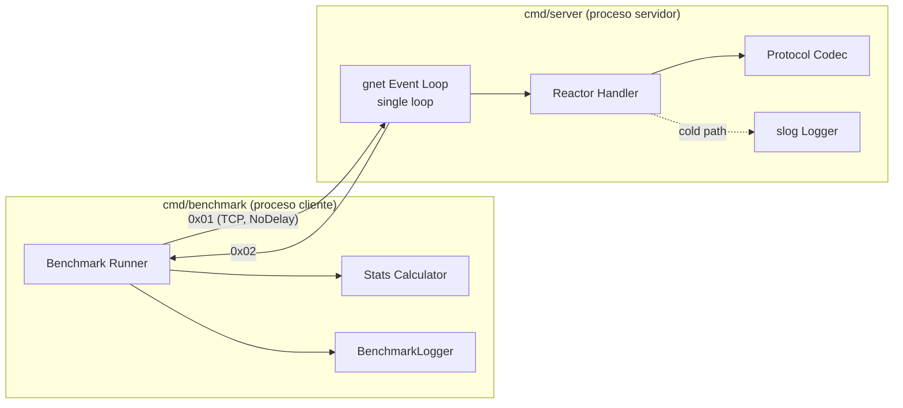

# Logical Components — Minimum Latency System

> Componentes lógicos del sistema con sus responsabilidades NFR, los patrones aplicados (ver `nfr-design-patterns.md`) y su clasificación hot/cold path.
> Nota: este sistema **no requiere componentes de infraestructura externa** (sin colas, caches, circuit breakers ni load balancers). Es un proceso único con un event loop in-process y un cliente in-process — coherente con la meta de latencia mínima sub-milisegundo (cualquier hop intermedio añadiría latencia).

---

## Vista General

---

## Componentes Lógicos

### LC-01 · gnet Event Loop (Reactor / Demultiplexer)

| Atributo | Detalle |
|---|---|
| **Ubicación física** | `cmd/server` (configuración) + runtime de `gnet/v2` |
| **Rol** | Synchronous Event Demultiplexer del Reactor Pattern |
| **Path** | 🔥 HOT |
| **Patrones** | PAT-PERF-01 (single loop), PAT-PERF-02 (TCP_NODELAY) |
| **Config** | `NumEventLoop=1`, `Multicore=false`, `TCPNoDelay=true`, bind `127.0.0.1:8080` |
| **Responsabilidad NFR** | Entregar eventos de I/O con mínima latencia y sin overhead de coordinación entre loops |

### LC-02 · Reactor Handler (Event Handler)

| Atributo | Detalle |
|---|---|
| **Ubicación física** | `internal/reactor` |
| **Rol** | Concrete Event Handler; implementa `gnet.EventHandler` (`OnBoot`, `OnOpen`, `OnTraffic`, `OnClose`, `OnShutdown`) |
| **Path** | 🔥 HOT (`OnTraffic`) / ❄️ COLD (lifecycle) |
| **Patrones** | PAT-PERF-03 (buffer `[1]byte` pre-allocated), PAT-RES-02 (fail-safe), PAT-RES-03 (recover), PAT-SEC-02 (no leakage) |
| **Estado interno** | `response [1]byte`, ref. a `gnet.Engine`, `*slog.Logger` |
| **Responsabilidad NFR** | 0 allocs en `OnTraffic`; validar tipo de mensaje; responder `0x02` o ignorar+loggear |

### LC-03 · Protocol Codec

| Atributo | Detalle |
|---|---|
| **Ubicación física** | `internal/protocol` |
| **Rol** | Funciones puras `Encode(msgType, buf) int` y `Decode(data) (byte, error)` + constantes `TypeStimulus/TypeResponse` |
| **Path** | 🔥 HOT |
| **Patrones** | PAT-PERF-04 (1 byte, sin framing), PAT-TEST-01 (roundtrip), PAT-PERF-03 (sin allocs) |
| **Responsabilidad NFR** | Serialización de 1 byte, 0 overhead, 0 allocs; base verificable por PBT |

### LC-04 · Logger (Structured)

| Atributo | Detalle |
|---|---|
| **Ubicación física** | `internal/logger` (wrapper de `log/slog`) |
| **Rol** | Logging estructurado JSON del sistema |
| **Path** | ❄️ COLD (nunca en el éxito del hot path) |
| **Patrones** | PAT-OBS-01 (slog/JSON, SECURITY-03) |
| **Responsabilidad NFR** | timestamp ISO 8601, level, msg; sin datos sensibles; cero impacto en latencia del hot path |

### LC-05 · Benchmark Runner

| Atributo | Detalle |
|---|---|
| **Ubicación física** | `cmd/benchmark` |
| **Rol** | Cliente de medición: conexión TCP persistente, loop single-shot de 10k iteraciones |
| **Path** | 🔥 HOT (loop de medición) |
| **Patrones** | PAT-PERF-02 (`SetNoDelay`), PAT-PERF-03 (`stimulus [1]byte`, `readBuf [1]byte`, `durations` con cap reservada), PAT-RES-02 (skip & continue) |
| **Responsabilidad NFR** | Medir latencia round-trip con `time.Now()` (reloj monotónico ns); resiliencia ante errores individuales |

### LC-06 · Stats Calculator

| Atributo | Detalle |
|---|---|
| **Ubicación física** | `internal/stats` |
| **Rol** | Función pura `Calculate(durations) Stats` + `Report()` |
| **Path** | ❄️ COLD (post-benchmark) |
| **Patrones** | PAT-TEST-01 (invariantes Min≤Median≤Max, P50≤P95≤P99) |
| **Responsabilidad NFR** | Cálculo de min/max/avg/median/p50/p95/p99 sobre iteraciones exitosas; comparación contra objetivo p99 < 1ms |

### LC-07 · BenchmarkLogger (Trace Buffer)

| Atributo | Detalle |
|---|---|
| **Ubicación física** | `internal/logger` |
| **Rol** | Buffer in-memory de trazas + flush diferido a `benchmark.log` |
| **Path** | 🔥 HOT (`Record`, solo escritura en slices pre-allocated) / ❄️ COLD (`FlushToFile`) |
| **Patrones** | PAT-OBS-02 (record-in-memory, flush-on-exit), PAT-PERF-03 (3 slices paralelos pre-allocated) |
| **Estado interno** | `sendTimes/recvTimes []time.Time`, `latencies []time.Duration`, `count int` (todos dimensionados a `iterations`) |
| **Responsabilidad NFR** | Trazabilidad por petición (SendTime/RecvTime/Latency) con **zero I/O** durante la medición |

---

## Clasificación Hot Path vs Cold Path

| Componente | Hot Path | Cold Path |
|---|---|---|
| LC-01 Event Loop | Demux + entrega de eventos | Boot / shutdown |
| LC-02 Reactor Handler | `OnTraffic` (responder) | `OnBoot/OnOpen/OnClose/OnShutdown`, log de inválidos |
| LC-03 Protocol Codec | `Encode` / `Decode` | — |
| LC-04 Logger | — | Todo el logging del servidor |
| LC-05 Benchmark Runner | Loop de medición | Setup / parse flags |
| LC-06 Stats Calculator | — | `Calculate` / `Report` post-benchmark |
| LC-07 BenchmarkLogger | `Record` (write a slices) | `FlushToFile` |

**Principio de diseño**: ninguna operación de I/O de disco, logging ni asignación de heap ocurre en un hot path. Todo el trabajo costoso (stats, flush, logs) se difiere al cold path post-benchmark.

---

## Componentes de Infraestructura — Evaluación

| Componente típico | ¿Aplica? | Justificación |
|---|---|---|
| Message Queue | ❌ No | Comunicación síncrona 1:1 directa; una cola añadiría latencia y allocs |
| Cache | ❌ No | No hay datos que cachear (mensaje sin payload, sin estado) |
| Circuit Breaker | ❌ No | Conexión única local; resiliencia cubierta por skip&continue (PAT-RES-02) |
| Load Balancer | ❌ No | Single event loop, una conexión (Q1=A) |
| Connection Pool | ❌ No | Conexión TCP persistente única, sin reconnect |
| Service Discovery | ❌ No | Dirección fija `127.0.0.1:8080` |

**Conclusión**: la topología óptima para latencia sub-ms es la **ausencia de infraestructura intermedia**. El diseño es deliberadamente un único hop in-process por proceso, comunicados por un único socket TCP local con Nagle deshabilitado.
