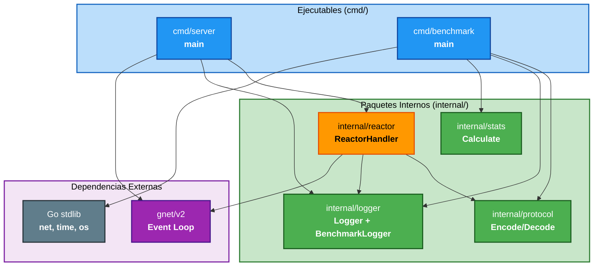

# Dependencias de Componentes — Minimum Latency Challenge

## Matriz de Dependencias

| Componente | Depende de | Tipo de Dependencia |
|---|---|---|
| `cmd/server` | `internal/reactor`, `internal/logger` | Import directo |
| `cmd/benchmark` | `internal/protocol`, `internal/logger`, `internal/stats` | Import directo |
| `internal/reactor` | `internal/protocol`, `internal/logger` | Import directo |
| `internal/protocol` | Ninguno (standalone) | — |
| `internal/logger` | Ninguno (standalone) | — |
| `internal/stats` | Ninguno (standalone) | — |

## Dependencias Externas

| Componente | Dependencia Externa | Versión |
|---|---|---|
| `cmd/server` | `github.com/panjf2000/gnet/v2` | Latest stable |
| `internal/reactor` | `github.com/panjf2000/gnet/v2` | Latest stable |
| `cmd/benchmark` | Standard library only (`net`, `time`, `os`) | Go 1.22+ |

---

## Grafo de Dependencias



---

## Patrones de Comunicación

### Server ↔ Benchmark (TCP)
- **Protocolo**: Binario ultra-minimal (1 byte tipo + payload)
- **Patrón**: Request-Response síncrono sobre conexión persistente
- **Dirección**: Bidireccional (client envía stimulus, server responde response)
- **Formato**: `0x01 + "ping"` → `0x02 + "pong"`

### Internal Components (Go Imports)
- **Patrón**: Llamadas de función directas (in-process)
- **Acoplamiento**: Loose coupling via interfaces y packages separados
- **Nota**: `internal/protocol`, `internal/logger` y `internal/stats` son standalone sin dependencias entre sí

---

## Estructura del Proyecto

```
minimum-latency-challenge/
+-- cmd/
|   +-- server/
|   |   +-- main.go              # Server entry point
|   +-- benchmark/
|       +-- main.go              # Benchmark client entry point
+-- internal/
|   +-- reactor/
|   |   +-- handler.go           # gnet EventHandler implementation
|   +-- protocol/
|   |   +-- protocol.go          # Binary encode/decode
|   |   +-- protocol_test.go     # PBT roundtrip tests
|   +-- logger/
|   |   +-- logger.go            # Structured logger
|   |   +-- benchmark_logger.go  # Buffered benchmark logger
|   +-- stats/
|       +-- stats.go             # Latency statistics
|       +-- stats_test.go        # Stats calculation tests
+-- docs/
|   +-- MODULO_1.md              # Context document
|   +-- Estructura-del-conocimiento.md
|   +-- system-documentation.md  # Generated: architecture docs
|   +-- results-report.md        # Generated: benchmark results
+-- go.mod
+-- go.sum
+-- README.md
```
