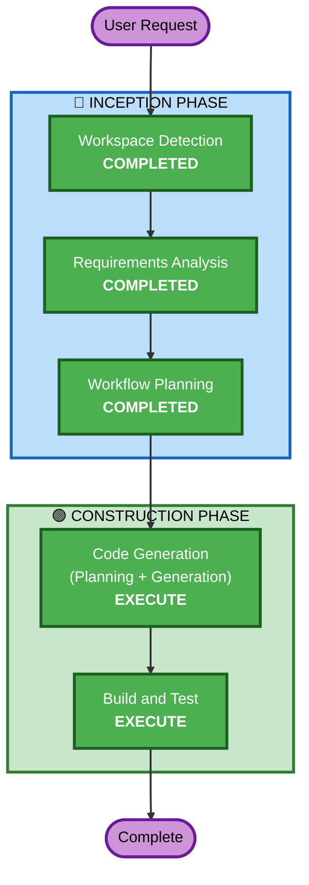

# Execution Plan — Intent V2: Stimulus Client Mode

## Detailed Analysis Summary

### Transformation Scope
- **Transformation Type**: Single component addition (new binary)
- **Primary Changes**: Nuevo `cmd/stimulus/main.go` — cliente interactivo
- **Related Components**: `internal/protocol`, `internal/logger` (reutilización, sin modificación)

### Change Impact Assessment
- **User-facing changes**: Sí — nuevo binario que el usuario ejecuta manualmente
- **Structural changes**: No — se agrega un `cmd/` nuevo, no se altera arquitectura existente
- **Data model changes**: No
- **API changes**: No — mismo protocolo binario (0x01 → 0x02)
- **NFR impact**: No — el hot path del servidor no se toca

### Risk Assessment
- **Risk Level**: Low
- **Rollback Complexity**: Easy (eliminar `cmd/stimulus/`)
- **Testing Complexity**: Simple (verificar send/recv + log output)

---

## Workflow Visualization



### Text Alternative
```
Phase 1: INCEPTION
  - Workspace Detection (COMPLETED)
  - Reverse Engineering (SKIP — artifacts exist)
  - Requirements Analysis (COMPLETED)
  - User Stories (SKIP — fix simple)
  - Workflow Planning (COMPLETED)
  - Application Design (SKIP — no new components/methods in existing packages)
  - Units Generation (SKIP — single unit)

Phase 2: CONSTRUCTION
  - Functional Design (SKIP — logic trivial: stdin loop + send/recv)
  - NFR Requirements (SKIP — existing NFRs apply unchanged)
  - NFR Design (SKIP — no new NFR patterns needed)
  - Infrastructure Design (SKIP — no infra changes)
  - Code Generation (EXECUTE)
  - Build and Test (EXECUTE)
```

---

## Phases to Execute

### 🔵 INCEPTION PHASE
- [x] Workspace Detection (COMPLETED)
- [x] Reverse Engineering (SKIP — artifacts exist from prior cycle)
- [x] Requirements Analysis (COMPLETED)
- [x] User Stories (SKIP — enhancement simple, single user persona)
- [x] Workflow Planning (COMPLETED)
- [x] Application Design (SKIP — no new component methods, reutiliza paquetes existentes)
- [x] Units Generation (SKIP — single unit of work)

### 🟢 CONSTRUCTION PHASE
- [x] Functional Design (SKIP — lógica trivial: read stdin, send 0x01, recv 0x02, print latency)
- [x] NFR Requirements (SKIP — NFRs existentes aplican sin cambios)
- [x] NFR Design (SKIP — no se requieren nuevos patrones NFR)
- [x] Infrastructure Design (SKIP — no hay cambios de infraestructura)
- [ ] Code Generation — **EXECUTE**
  - **Rationale**: Implementar `cmd/stimulus/main.go` con stdin loop, logging, graceful shutdown
- [ ] Build and Test — **EXECUTE**
  - **Rationale**: Compilar, verificar que funciona contra el servidor, validar log output

### 🟡 OPERATIONS PHASE
- [ ] Operations — PLACEHOLDER

---

## Execution Summary
- **Total Stages**: 12
- **Stages to Execute**: 2 (Code Generation, Build and Test)
- **Stages Completed**: 3 (Workspace Detection, Requirements Analysis, Workflow Planning)
- **Stages Skipped**: 7

## Success Criteria
- **Primary Goal**: Usuario puede enviar estímulos individuales al servidor en cualquier momento
- **Key Deliverables**: `cmd/stimulus/main.go`, archivo .log configurable
- **Quality Gates**: 
  - Binario compila sin errores
  - Envía estímulo y recibe respuesta correcta (0x02)
  - Muestra latencia en consola
  - Escribe log de trazabilidad
  - Graceful shutdown con SIGINT
  - Zero-allocation en hot path del cliente (buffers pre-allocated)
