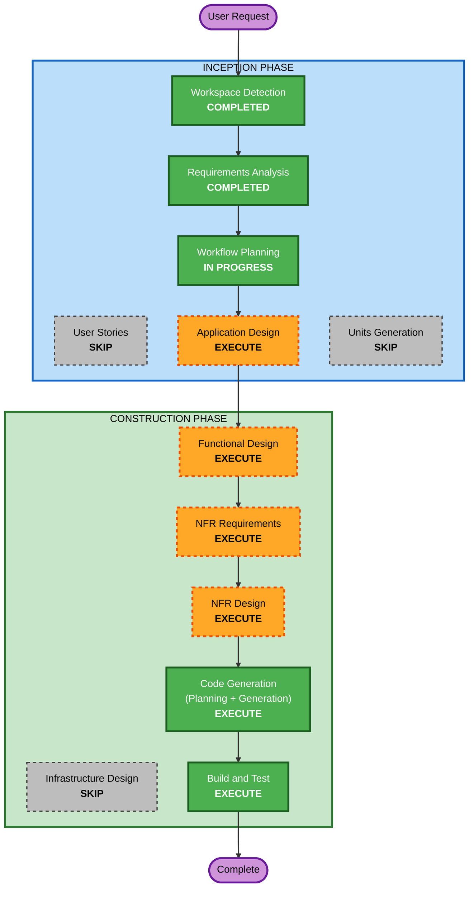

# Execution Plan — Minimum Latency Challenge

## Detailed Analysis Summary

### Change Impact Assessment
- **User-facing changes**: N/A — sistema CLI de benchmark, no tiene UI
- **Structural changes**: Sí — nuevo sistema desde cero con Reactor Pattern
- **Data model changes**: Sí — protocolo binario customizado (nuevo schema)
- **API changes**: Sí — nuevo protocolo de comunicación TCP binario
- **NFR impact**: Sí — rendimiento es el core del proyecto (< 1ms latencia)

### Risk Assessment
- **Risk Level**: Medium — Reactor Pattern en Go no es el approach idiomático, requiere frameworks especializados
- **Rollback Complexity**: Easy — proyecto greenfield, no hay sistema existente que afectar
- **Testing Complexity**: Moderate — benchmark de latencia requiere condiciones controladas

---

## Workflow Visualization



### Text Alternative
```
Phase 1: INCEPTION
  - Stage 1: Workspace Detection (COMPLETED)
  - Stage 2: Requirements Analysis (COMPLETED)
  - Stage 3: User Stories (SKIP)
  - Stage 4: Workflow Planning (COMPLETED)
  - Stage 5: Application Design (EXECUTE)
  - Stage 6: Units Generation (SKIP)

Phase 2: CONSTRUCTION
  - Stage 7: Functional Design (EXECUTE)
  - Stage 8: NFR Requirements (EXECUTE)
  - Stage 9: NFR Design (EXECUTE)
  - Stage 10: Infrastructure Design (SKIP)
  - Stage 11: Code Generation (EXECUTE)
  - Stage 12: Build and Test (EXECUTE)
```

---

## Phases to Execute

### 🔵 INCEPTION PHASE
- [x] Workspace Detection (COMPLETED)
- [x] Reverse Engineering (SKIPPED — Greenfield)
- [x] Requirements Analysis (COMPLETED — v2 with Reactor Pattern)
- [x] User Stories (SKIPPED)
  - **Rationale**: Proyecto técnico sin múltiples personas. El benchmark no tiene user interactions complejas.
- [x] Workflow Planning (IN PROGRESS)
- [ ] Application Design - **EXECUTE**
  - **Rationale**: Nuevo sistema que requiere diseño de componentes (Server, Client, Protocol, Logger, Benchmark), definición de interfaces y flujo del Reactor Pattern. También resolverá decisiones pendientes: protocolo binario, framework vs custom.
- [ ] Units Generation - **SKIP**
  - **Rationale**: Sistema simple con un solo unit de trabajo. Server, Client y Benchmark son parte del mismo módulo Go. No requiere descomposición en múltiples units paralelos.

### 🟢 CONSTRUCTION PHASE
- [ ] Functional Design - **EXECUTE**
  - **Rationale**: El protocolo binario customizado necesita diseño detallado: formato del header, payload, handshake. Los handlers del Reactor Pattern necesitan business logic diseñada.
- [ ] NFR Requirements - **EXECUTE**
  - **Rationale**: Rendimiento es el atributo de calidad CRÍTICO. Necesita definir tech stack (gnet vs evio vs custom), estrategias de optimización, y métricas de aceptación. PBT-09 requiere framework selection.
- [ ] NFR Design - **EXECUTE**
  - **Rationale**: Patrones de Reactor Pattern, zero-allocation, pre-allocated buffers, connection pooling necesitan diseño detallado. Las optimizaciones del Go runtime (GOMAXPROCS, GC tuning) deben ser documentadas.
- [ ] Infrastructure Design - **SKIP**
  - **Rationale**: Sistema ejecutado localmente en Windows. No hay infraestructura cloud, no hay deployment, no hay networking externo.
- [ ] Code Generation - **EXECUTE** (ALWAYS)
  - **Rationale**: Part 1: Plan de generación de código con checkboxes. Part 2: Implementación del server, client, benchmark, protocol, logging, documentación, informe de resultados.
- [ ] Build and Test - **EXECUTE** (ALWAYS)
  - **Rationale**: Compilación del proyecto Go, ejecución del benchmark de 10,000 iteraciones, generación de logs, property-based tests para roundtrip del protocolo binario.

### 🟡 OPERATIONS PHASE
- [ ] Operations - **PLACEHOLDER**
  - **Rationale**: Placeholder para futuros workflows de deployment y monitoreo.

---

## Estimated Timeline
- **Total Stages to Execute**: 7 (Application Design → Functional Design → NFR Requirements → NFR Design → Code Generation → Build and Test)
- **Total Stages to Skip**: 4 (User Stories, Units Generation, Infrastructure Design, Reverse Engineering)

## Success Criteria
- **Primary Goal**: Latencia round-trip < 1ms (idealmente < 100µs) usando Reactor Pattern sobre TCP localhost
- **Key Deliverables**:
  1. Servidor Go con Reactor Pattern escuchando en TCP localhost
  2. Cliente de benchmark ejecutando 10,000 iteraciones
  3. Protocolo binario customizado
  4. Archivo de log con trazabilidad por petición + estadísticas resumen
  5. Documentación técnica (.md) con justificación de arquitectura
  6. Informe de resultados (.md) con análisis de latencia
  7. Property-based tests para roundtrip del protocolo binario
- **Quality Gates**:
  1. Latencia p99 < 1ms
  2. Servidor estable sin crashes durante 10,000 iteraciones
  3. Logs completos con timestamps y estadísticas
  4. PBT-02 compliant (roundtrip serialize/deserialize)
  5. SECURITY-03 compliant (structured logging)
  6. SECURITY-15 compliant (error handling, fail-safe)
