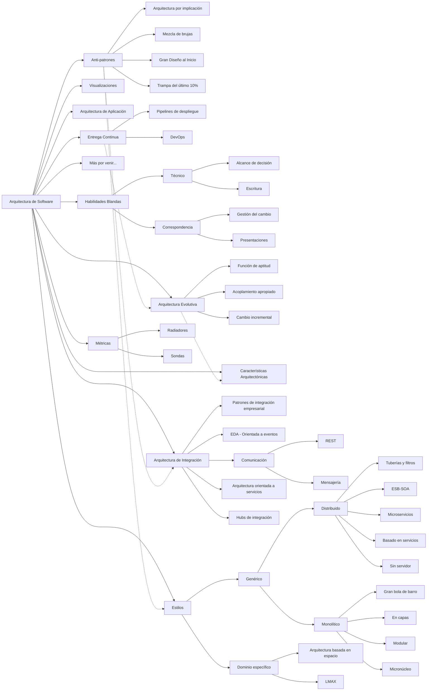
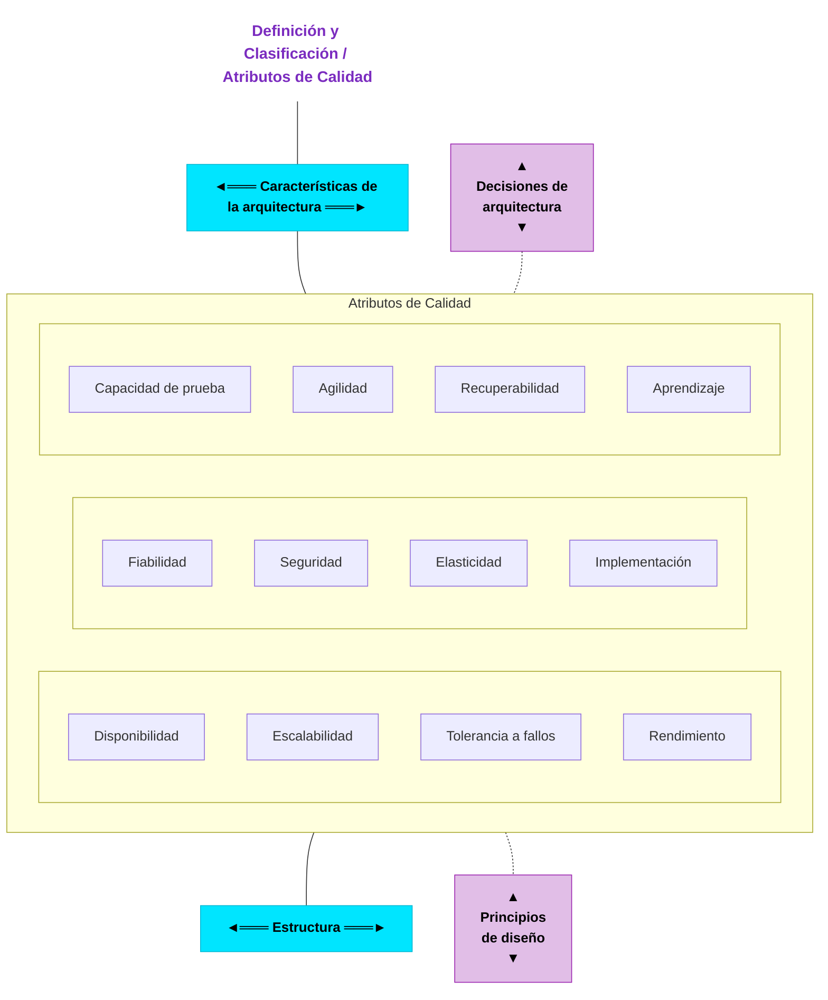
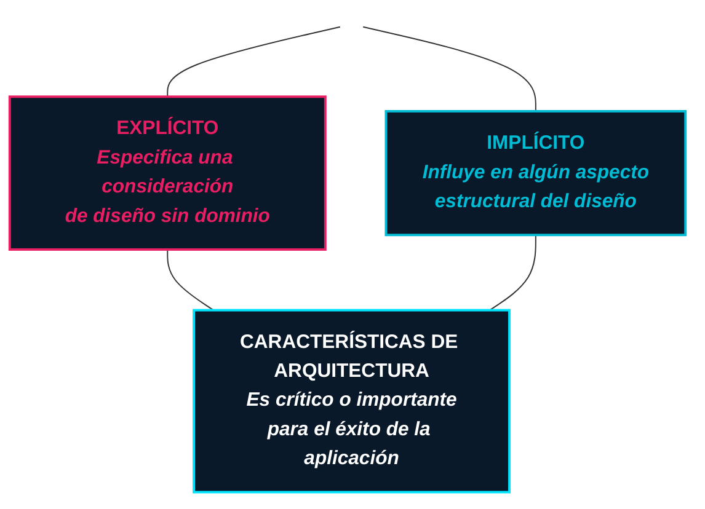
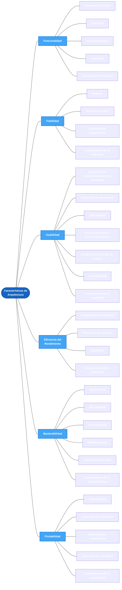

# Algunas definiciones de que es arquitectura de software

## IEE 40010-2011

> Fundamental concepts or properties of a system in its environment embodied in its elements, relationships, and in the principles of its design and evolution.

*Conceptos fundamentales o propiedades de un sistema en su entorno, incorporados en sus elementos, relaciones y en los principios de su diseño y evolución.*

## IEE 1471-2000

> Architecture is the fundamental organization of a system embodied in its components, their relationships to each other, and to the environment, and the principles guiding its design and evolution.

*La arquitectura es la organización fundamental de un sistema, incorporada en sus componentes, en las relaciones entre ellos y con el entorno, y en los principios que guían su diseño y evolución.*

##  Philippe Kruchten [RUP 2023]

> An architecture is the set of significant decisions about the organization of a software system, the selection of structural elements and their interfaces by which the system is composed, together with their behavior as specified in the collaborations among those elements, the composition of these elements into progressively larger subsystems, and the architectural style that guides this organization -- these elements and their interfaces, their collaborations, and their composition.

*Una arquitectura es el conjunto de decisiones significativas sobre la organización de un sistema de software, la selección de los elementos estructurales y sus interfaces mediante los cuales se compone el sistema, junto con su comportamiento tal como se especifica en las colaboraciones entre dichos elementos, la composición de estos elementos en subsistemas progresivamente más grandes y el estilo arquitectónico que guía esta organización: estos elementos y sus interfaces, sus colaboraciones y su composición.*

## Ralph Johnson

> Architecture is about the important stuff…whatever that is...

*La arquitectura trata sobre las cosas importantes… sean cuales sean.*

## Software Architecture in Practice 4th Ed

> The software architecture of a system is the set of structures needed to reason about the system. These structures comprise software elements, relations among them and properties of both.

*La arquitectura de software de un sistema es el conjunto de estructuras necesarias para razonar sobre el sistema. Estas estructuras comprenden elementos de software, las relaciones entre ellos y las propiedades de ambos.*

# Implicaciones de la definicion de la arquitectura

## Arquitectura versus diseño

La arquitectura es diseño, pero no todo diseño es arquitectura. Es decir, muchas decisiones de diseño terminan por no estar vinculadas a la arquitectura dado que es, después de todo, una abstracción y dependen entonces de la discreción y buen juicio de los diseñadores posteriores, e incluso, de quienes las implementarán. 

## La arquitectura es una abstracción 

Dado que la arquitectura consta de estructuras, y las estructuras se componen de elementos y relaciones; en consecuencia, tenemos que una arquitectura comprende elementos de software y el cómo esos elementos se relacionan entre sí. Esto significa que la arquitectura, específica e intencionalmente, omite cierta información sobre aquellos elementos que no son útiles para el razonamiento sobre el sistema. De modo que la arquitectura es, en esencia, la abstracción de un sistema que selecciona ciertos detalles y omite otros. 

## La arquitectura es un conjunto de estructuras de software

Una estructura es simplemente un set de elementos unidos por una relación. Los sistemas de software están compuestos de muchas estructuras, y no hay una estructura única que pueda reclamar ser la arquitectura. Las estructuras pueden ser agrupadas en categorías, y las categorías en sí mismas nos proveen formas útiles de pensar sobre la arquitectura. 

## Todo sistema de software tiene una arquitectura de software

Todo sistema tiene una arquitectura, porque todos los sistemas tienen elementos y relaciones. Esto demuestra que existe una diferencia entre la arquitectura de un sistema y la representación de ella. Dado que una arquitectura puede existir independientemente de su descripción o especificación, esto muestra la importancia de la documentación de la arquitectura. 

## No todas las arquitecturas son buenas arquitecturas

Nuestra definición es indiferente sobre si la arquitectura de un sistema es buena o mala. Una determinada arquitectura bien puede favorecer o dificultar la consecución de necesidades importantes para el sistema. 

## La arquitectura incluye el comportamiento

El comportamiento de cada elemento es parte de la arquitectura en la medida en que el comportamiento puede ayudarnos a pensar acerca del sistema. El comportamiento de los elementos refleja cómo interactúan entre ellos y con el ambiente. 

# Leyes y alcance de la arquitectura de software 

## Leyes 

### Primera ley: 

> “Todo en la arquitectura de software es un intercambio (trade off)”.

### Segunda ley: 

> “El por qué es más importante que el cómo”.

## Alcance de la arquitectura de software 

- Las responsabilidades de un arquitecto de software abarcan habilidades técnicas, habilidades blandas, conciencia operativa y muchas otras.

- La arquitectura consiste en la estructura combinada con las características de la arquitectura ("-ilidades"), las decisiones de arquitectura y los principios de diseño.

- La estructura se refiere al tipo de estilos de arquitectura utilizados en el sistema.

- Las características de la arquitectura se refieren a las  "-ilidades" que el sistema debe soportar.

- Las decisiones de arquitectura son reglas para construir sistemas.

- Los principios de diseño son pautas para construir sistemas. 

###  Conclusiones

# Restricciones y decisiones de la arquitectura 

## Restricciones  de la arquitectura 

En la arquitectura de software, las restricciones son reglas o limitaciones que dictan ciertos aspectos del diseño y la implementación del sistema.
Estas restricciones pueden originarse a partir de requerimientos específicos del negocio, limitaciones tecnológicas, o el capital humano disponible, entre otros factores. Comprender y gestionar estas restricciones es crucial para el éxito de un proyecto de software, ya que influyen significativamente en las decisiones arquitectónicas (Bass, Clements, y Kazman, 2015).

### Tipos de restricciones

- **Restricciones de negocio**:

    Las restricciones de negocio se derivan de las necesidades, estrategias, y objetivos específicos de la organización que implementa el sistema. Estas incluyen:

    **Requisitos de mercado:** como la necesidad de lanzar un producto antes de una fecha específica para captar una oportunidad de mercado.

    **Presupuesto:** limitaciones en los recursos financieros disponibles que pueden afectar la elección de tecnologías o la capacidad de implementar ciertas características.

    **Regulaciones y cumplimiento legal:** normativas que el software debe cumplir, lo que puede limitar las opciones de diseño o requerir ciertas funcionalidades.

- **Restricciones de tecnologia**:

    Las restricciones tecnológicas están relacionadas con las herramientas, plataformas, y estándares existentes que deben ser utilizados en el desarrollo del sistema. Estas incluyen:

    **Compatibilidad con sistemas existentes:** requisitos para que el nuevo sistema funcione con sistemas legados o tecnologías específicas preexistentes.  

    **Infraestructura disponible:** las capacidades de la infraestructura actual que pueden limitar el rendimiento o la escalabilidad del sistema.

    **Tecnologías obligatorias:** Decisiones corporativas o de proyecto que requieren el uso de ciertas herramientas o tecnologías, a veces por razones de seguridad, soporte o acuerdos preexistentes con proveedores.

- **Restricciones de personas/Conocimiento**:

    Estas restricciones están ligadas a las habilidades, experiencia y número de personal disponible para trabajar en el proyecto; estas abarcan lo siguiente:

    **Experiencia del equipo:** las tecnologías o metodologías que el equipo domina pueden influir en la arquitectura elegida.

    **Disponibilidad de especialistas:** la falta de expertos en un área tecnológica específica puede limitar las opciones de diseño o requerir capacitación adicional, impactando los plazos y costos.

    **Cultura organizacional:** las preferencias o aversiones de la organización hacia ciertas prácticas o tecnologías también pueden imponer restricciones en el diseño del sistema.

## Decisiones de la arquitectura 

Las decisiones de arquitectura son elecciones fundamentales que definen la estructura y el comportamiento de un sistema de software. Estas decisiones abordan problemas críticos del diseño del sistema y establecen las bases sobre las cuales el software será construido y evolucionará a lo largo del tiempo (Bass, Clements, y Kazman, 2012).
Estas, son cruciales porque configuran el marco dentro del cual se tomarán todas las demás decisiones técnicas. Afectan la selección de tecnologías, la formulación de políticas de desarrollo y mantenimiento y las estrategias de implementación. Al definir cómo se organizan y se interconectan los componentes del software, estas decisiones impactan directamente en la capacidad del sistema para cumplir con los requisitos funcionales y no funcionales, influenciando atributos de calidad como la performance, la seguridad, y la facilidad de mantenimiento.

### Tipos de consecuencias

- **Consecuencias de malas decisiones de arquitectura:**

    Rigidez del Sistema: una arquitectura mal diseñada puede ser difícil de modificar y expandir, lo que puede obstaculizar la adaptación del sistema a nuevos requisitos o tecnologías.

    **Costos incrementados:** decisiones equivocadas pueden resultar en retrabajos costosos y aumentos en el tiempo de desarrollo y mantenimiento.  

    **Degradación del rendimiento:** una arquitectura que no considera adecuadamente los atributos de rendimiento necesarios puede llevar a un sistema que no cumple con las expectativas de los usuarios o los estándares de la industria.

- **Consecuencias de buenas decisiones de arquitectura:**

    Consistencia y cohesión: facilita la integración de diferentes componentes y promueve un enfoque uniforme en el desarrollo.

    **Claridad y comunicabilidad:** hace que la arquitectura sea más fácil de entender y comunicar a todas las partes interesadas, reduciendo así los riesgos de malentendidos y errores en las fases de desarrollo.

    **Flexibilidad y escalabilidad:** permite que el sistema se adapte más fácilmente a cambios en los requisitos o en el entorno tecnológico.

# Atributos de calidad 

## Definición y clasificación atributos de calidad

 ## Caracteristicas de arquitectura

Muchas organizaciones describen estas caracteristicas del software con una variedad de terminos, inlcuidos requisitos no funcionales y atributos de calidad.

Una caracteristica de arquitectura cumple tres criterios:

- Especifica una consideración de diseño sin dominio.

- Influye en algun aspecto estructural del diseño.

- Es critico o importante para el exito de la aplicación.

 ## Caracteristicas de arquitectura operacionales

 ### Disponibilidad
 Tiempo que el sistema debe estar operativo (si es 24/7, se requieren medidas para garantizar su rápida recuperación ante fallos).

 ### Escalabilidad
 Capacidad del sistema para mantener su rendimiento y operatividad ante el aumento de usuarios o solicitudes.

  ### Continuidad
  Capacidad de recuperación ante desastres.

  ### Robustez
  Capacidad del sistema para manejar errores y condiciones límite durante su ejecución, como caídas de conexión a Internet, cortes de energía o fallos de hardware.

  ### Rendimiento
  Incluye pruebas de estrés, análisis de picos, frecuencia de uso de funciones, capacidad requerida y tiempos de respuesta.

### Confiabilidad/Seguridad
Evalúa si el sistema debe ser a prueba de fallos o es crítico
(ej.: afecta vidas humanas o generaría pérdidas financieras significativas).

### Recuperabilidad
Requisitos de continuidad del negocio (ej.: tiempo máximo para restaurar el sistema tras un desastre). Esto impacta la estrategia de backups y la necesidad de hardware redundante

 ## Caracteristicas de arquitectura estructurales

 ### Configurabilidad
 Capacidad que tienen los usuarios finales para modificar fácilmente aspectos de la configuración del software mediante interfaces intuitivas.

 ### Extensibilidad
 Grado de importancia para incorporar nuevas funcionalidades al sistema de manera modular.

 ### Capacidad de instalación
 Facilidad para desplegar el sistema en todas las plataformas requeridas.

### Reutilización
Habilidad para aprovechar componentes comunes en múltiples productos.

### Localización
Soporte para múltiples idiomas en pantallas de entrada/consulta, informes, caracteres multibyte, así como unidades de medida y monedas locales.

### Mantenibilidad
Facilidad para implementar cambios y mejoras en el sistema a lo largo del tiempo.

### Portabilidad
¿Requiere el sistema ejecutarse en múltiples plataformas? (Ejemplo: ¿debe funcionar el frontend tanto con Oracle como con SAP DB?).

### Capacidad de actualización
Facilidad para migrar rápidamente desde una versión anterior de la aplicación/solución a una versión más reciente, tanto en servidores como en clientes.

 ## Caracteristicas de arquitectura transversales icross-cutting

 ### Accesibilidad

Garantizar el acceso a todos los usuarios, incluyendo aquellos con discapacidades como daltonismo o perdida auditiva.

### Capacidad de archivado

¿Los datos deberán archivarse o eliminarse después de un tiempo determinado ? (Ejemplo: cuentas de clientes que deben eliminarse despues de tres meses o marcarse como obsoletas y archivarse en una base de datos secundaria para acceso futuro)

### Autenticación
Requisitos de seguridad para verificar la identidad de los usuarios.

### Autorización
 Requisitos de seguridad para controlar el acceso a funciones especificas dentro de la aplicación (Por caso de uso, subsistema, página web, regla de negocio, nivel de campo etc).

### Aspectos legales
¿ Que restricciones legislativas afectan al sistema (protección de datos, Sarbanes Oxley, GDPR, etc) ?
Que derechos de reserva requiere la empresa ?, ¿ Existen regulaciones sobre como debe construirse o implementarse la aplicación ?

### Privacidad
Capacidad de proteger transacciones incluso del personal interno (mediante encriptación que impida el acceso a administradores de bases de datos y arquitectos de red)

### Seguridad
Nivel de asistencia tecnica requerido:

- Complejidad de logs necesarios.
 - Herramientas de diagnostico para depuración.
  - Recursos para solución de incidencias

### Usabilidad
Consideraciones criticas:
- Curva de aprendizaje para usuarios.
 - Diseño intuitivo centrado en experiencia de usuario.

- Requisitos ergonomicos (deben priorizarse como cualquier aspecto arquitectural)

## Carecteristicas de arquitectura ISO/IEC 25021

### Ingles table

| Functional Suitability     | Performance Efficiency | Compatibility    | Interaction Capability          | Reliability     | Security        | Maintainability | Flexibility      | Safety                 |
| -------------------------- | ---------------------- | ---------------- | ------------------------------- | --------------- | --------------- | --------------- | ---------------- | ---------------------- |
| Functional Completeness    | Time Behaviour         | Co-existence     | Appropriateness Recognizability | Faultlessness   | Confidentiality | Modularity      | Adaptability     | Operational Constraint |
| Functional Correctness     | Resource Utilization   | Interoperability | Learnability                    | Availability    | Integrity       | Reusability     | Scalability      | Risk Identification    |
| Functional Appropriateness | Capacity               |                  | Operability                     | Fault Tolerance | Non-repudiation | Analysability   | Installability   | Fail Safe              |
|                            |                        |                  | User Error Protection           | Recoverability  | Accountability  | Modifiability   | Replaceability   | Hazard Warning         |
|                            |                        |                  | User Engagement                 | Authenticity    | Testability     |                 | Safe Integration |                        |
|                            |                        |                  | Inclusivity                     | Resistance      |                 |                 |                  |                        |
|                            |                        |                  | User Assistance                 |                 |                 |                 |                  |                        |
|                            |                        |                  | Self-Descriptiveness            |                 |                 |                 |                  |                        |

 ### Tabla en español

 | Adecuación Funcional  | Eficiencia del Rendimiento | Compatibilidad    | Capacidad de Interacción              | Fiabilidad          | Seguridad           | Mantenibilidad        | Flexibilidad             | Seguridad Operacional     |
| --------------------- | -------------------------- | ----------------- | ------------------------------------- | ------------------- | ------------------- | --------------------- | ------------------------ | ------------------------- |
| Completitud Funcional | Comportamiento Temporal    | Coexistencia      | Reconocimiento de Adecuación          | Ausencia de Fallos  | Confidencialidad    | Modularidad           | Adaptabilidad            | Restricción Operacional   |
| Corrección Funcional  | Utilización de Recursos    | Interoperabilidad | Facilidad de Aprendizaje              | Disponibilidad      | Integridad          | Reusabilidad          | Escalabilidad            | Identificación de Riesgos |
| Pertinencia Funcional | Capacidad                  |                   | Operabilidad                          | Tolerancia a Fallos | No Repudio          | Capacidad de Análisis | Capacidad de Instalación | A prueba de fallos        |
|                       |                            |                   | Protección contra errores del usuario | Recuperabilidad     | Responsabilidad     | Modificabilidad       | Reemplazabilidad         | Advertencia de Peligros   |
|                       |                            |                   | Compromiso del Usuario                | Autenticidad        | Capacidad de Prueba |                       | Integración Segura       |                           |
|                       |                            |                   | Inclusividad                          | Resistencia         |                     |                       |                          |                           |
|                       |                            |                   | Asistencia al Usuario                 |                     |                     |                       |                          |                           |
|                       |                            |                   | Auto descriptividad                   |                     |                     |                       |                          |                           |

## Caracteristicas de arquitectura mapa general

